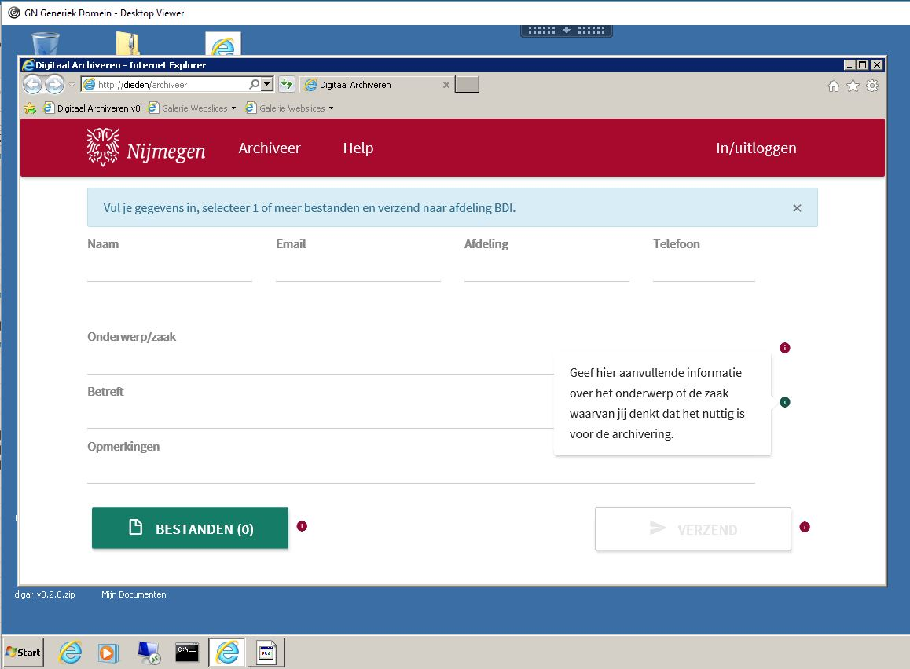

## Table of Contents
- [Installation](#installation)
- [Features](#features)
- [FAQ](#faq)
- [test1.dm](./content/test1.md)

## Installation
- All the `code` required to get started
- Images of what it should look like

## Features
Dit zijn de features

## FAQ
Dit is de faq

#Afbeeldingen

<a href="http://ag4it.nl">Link naar ag4it</a>

Afbeelding zelf (werkt op github.com maar niet op github.io)

---

<a href="http://ag4it.nl">Extern plaatje</a>

<a href="http://ag4it.nl">Extern plaatje</a>

